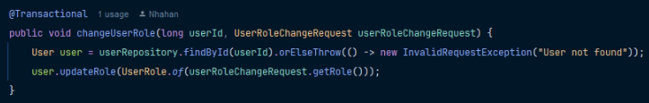
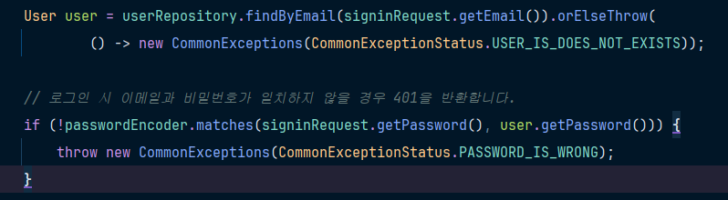
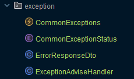

# SPRING ADVANCED

# 📱 백엔드 기본 요소를 기반으로 꼼꼼한 테스트까지 고려하는 백엔드 개발자를 향하여!
백엔드를 처음 배우고 낮설어하는 개발자를 위해, 직접 리펙토링하면서 백엔드에 한 발자국을 다가갈 수 있는 과제입니다.

# ⚠️ 클래스 설명
1. Controller
- 클라이언트에게 요청을 받고 응답하는 역할을 함
2. Service
- 비즈니스 로직을 수행함
- 요청을 해석해서 레포지토리 계층에게 전달함
3. Repository
- 데이터베이스와 연동하여 실제 데이터를 관리함
- CRUD를 수행
4. Entity
- 테이블과 매핑이 되는 클래스
5. RequestDto
- 클라이언트가 서버에게 요청하는 것
6. ResponseDto
- 서버가 클라이언트에게 응답하는 것
7. Filter
- JWT 토큰이 제대로 작동이 되는지 확인
8. Exceptionhandler
- 다양한 예외처리
9. Config
- 필터의 조건을 정함
10. APO
- 관점 지향 프로그래밍

# 🖥️ 개발환경
- JAVA 8
- JDK 21.0.5
- Spring Boot
- InteliJ IDEA
- JPA
- My SQL

# 🕰️ 개발기간
2025-02-21 ~ 2025-02-27

# 📌 필수기능

## Lv 1. 코드 개선
1. ### 조건에 맞지 않는 경우 즉시 리턴하여, 불필요한 로직의 실행 방지하고 성능을 향상시킵니다.
2. ### 불필요한 if-else문을 피해서, 코드의 가독성을 향상시킬 수 있습니다.
3. ### Validation을 사용해서, 조건을 적용할 수 있습니다.

## Lv 2. N+1 문제
1. ### @EntityGraph 기반으로 구현을 해야합니다.

## Lv 3. 테스트코드 연습
1. ### 코드에서 개선될 수 있는 부분을 찾아 정의하고, 해결하는 과정을 거칩니다.
# ⭐ 도전기능
## LV 4. AOP를 통한 API 로깅
1. #### 어드민 사용자만 접근할 수 있는 컨트롤러 메서드는 두 가지입니다.
2. **조건**
- @Around를 사용해서 메서드 실행 전후에 요청/응답 데이터를 로깅합니다.
- 회원가입, 로그인 요청은 인증 처리에서 제외합니다.

## LV 5. 위 제시된 기능 이외 '내'가 정의한 문제와 해결 과정
1. 현재 이 코드에서는 예외처리가 한 곳으로 모아져있지않아 각 클래스 별로 예외처리 클래스가 적용이 되어있음.
2. ENUM 클래스를 생성하여, 원하는 예외처리를 한곳으로 모아서 만듬으로서 개발할 시에 필요한 예외처리를 쉽게 적용할 수 있음.
3. @RestcontrollerAdvice를 통해서 내가 원하는 예외처리 커스텀마이징을 할 수 있음.
4. 코드 적용 전  
5. 코드 적용 후   
4. 예외처리를 해야하는 구문에 적용을 하여, 무슨 에러를 보낼 것인지 직관성 있게 변경되었음.
